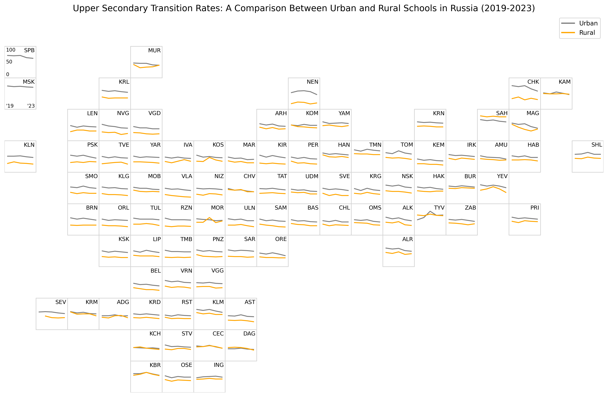

# grid-map-line-multiseries-russia
  <h2>Upper Secondary Transition Rates: A Comparison Between Urban and Rural Schools in Russia (2019-2023)</h2>
  
In recent years, there has been a significant trend in the educational trajectories of Russian youth. Pupils are leaving school after completing lower secondary education and opting for vocational schools instead of upper secondary education. This trend began approximately six to eight years ago. Over the last five years, in some regions, 8 to 10 pupils out of every 100 have changed their educational strategy in favor of vocational training. This shift is most pronounced in certain rural regions of Central Russia and in some industrial areas of the Volga and Ural regions. Due to the uneven distribution of land across Russian regions, it is quite challenging to visualize such trends when comparing regions. A grid map is one way to achieve this.
  
<b>Data Source</b>: Ministry of Education of the Russian Federation
  
<b>Grid Map Design</b>: Ivan Dianov

